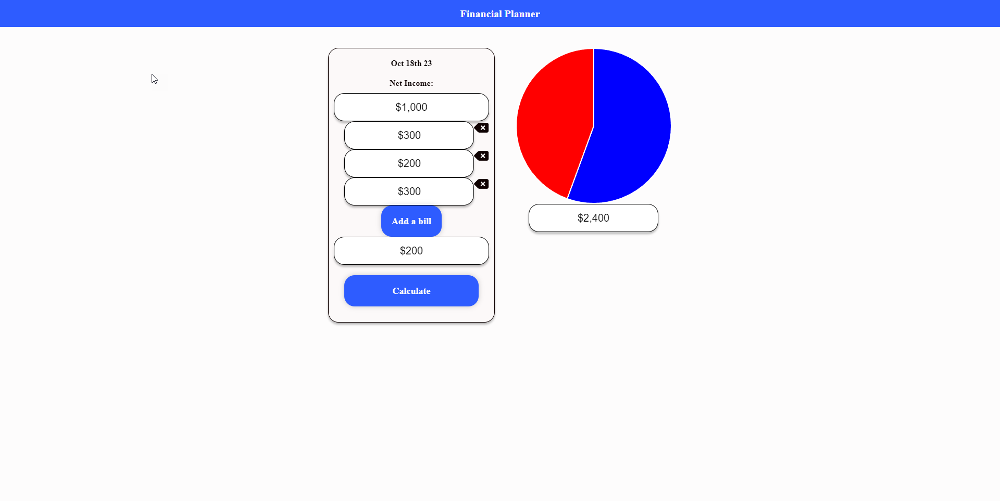

# Financial planner

The Financial Planner app is a powerful tool designed to help users manage and safeguard their financial data. With an intuitive and secure platform, users can efficiently organize and access their financial information, allowing for better financial planning and peace of mind in an increasingly digital world.

Technologies uses:

- React
- ChartJs
- HTML
- CSS
